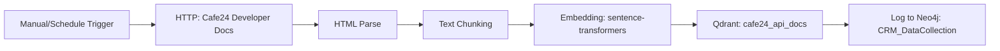
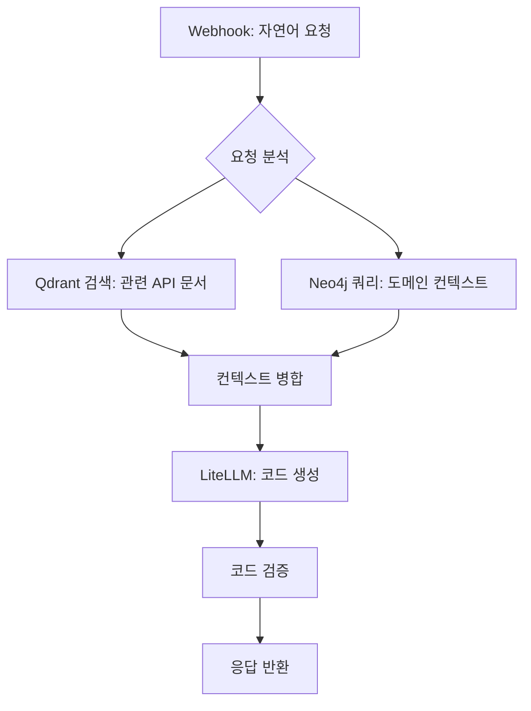
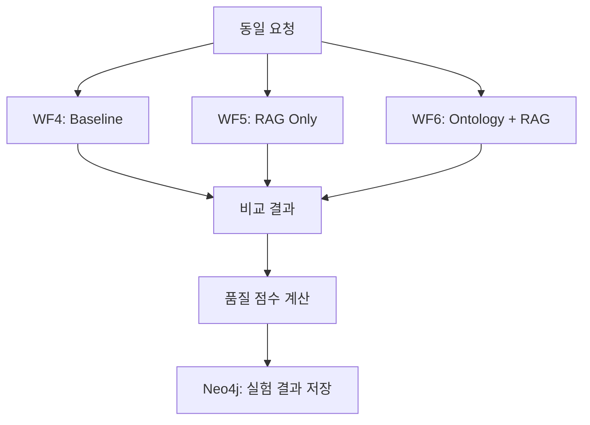
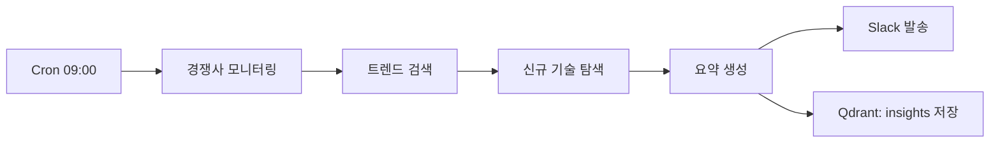
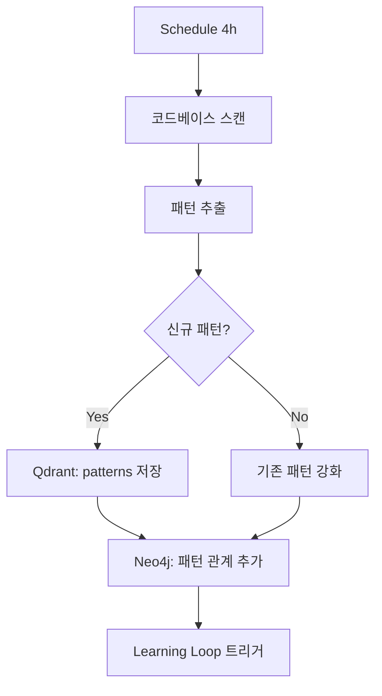
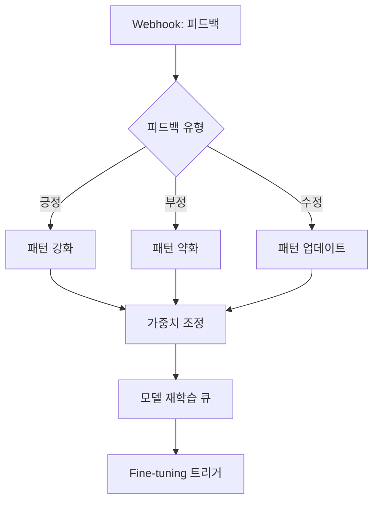

# Cafe24 CRM Prototype - n8n 워크플로우 아키텍처

> **목적**: AI 데모/프레젠테이션용 프로토타입
> **명명 규칙**: 모든 워크플로우는 `Cafe24_CRM_*` 접두사 사용
> **분리 원칙**: 기존 뉴스레터/데이터라이즈 워크플로우와 완전 독립

---

## 📋 워크플로우 전체 구조 (15개)

### Layer 1: 기본 데이터 수집 & 코드 생성 (워크플로우 1-7)

| ID | 워크플로우명 | 트리거 | 주요 기능 |
|----|-------------|--------|-----------|
| 1 | Cafe24_CRM_API_Doc_Collector | Manual/Schedule | Cafe24 API 문서 크롤링 → Qdrant 임베딩 |
| 2 | Cafe24_CRM_Ontology_Builder | Webhook | 도메인 YAML → Neo4j CRM 온톨로지 갱신 |
| 3 | Cafe24_CRM_Code_Generator | Webhook | 자연어 요청 → 코드 생성 (RAG + Ontology) |
| 4 | Cafe24_CRM_A_Baseline | Webhook | 순수 LLM 응답 (비교 기준) |
| 5 | Cafe24_CRM_B_RAG_Only | Webhook | RAG만 사용 응답 |
| 6 | Cafe24_CRM_C_Ontology_Plus | Webhook | Ontology + RAG 융합 응답 |
| 7 | Cafe24_CRM_Dashboard_API | HTTP | 대시보드 백엔드 API |

### Layer 2: 자동 니즈 발견 & 설계 개선 (워크플로우 8-10)

| ID | 워크플로우명 | 트리거 | 주요 기능 |
|----|-------------|--------|-----------|
| 8 | Cafe24_CRM_Morning_Research | Cron 09:00 | 아침 시장조사 (경쟁사, 트렌드) |
| 9 | Cafe24_CRM_Evening_Analysis | Cron 21:00 | 저녁 분석 (일일 피드백, 패턴) |
| 10 | Cafe24_CRM_Weekly_Retrospective | Cron Sun 10:00 | 주간 회고 & 개선 제안 |

### Layer 3: Emergent Intelligence (워크플로우 11-15)

| ID | 워크플로우명 | 트리거 | 주요 기능 |
|----|-------------|--------|-----------|
| 11 | Cafe24_CRM_Code_Analyzer | Schedule 4h | 코드베이스 패턴 분석 |
| 12 | Cafe24_CRM_Ontology_Health | Schedule 6h | 온톨로지 품질 모니터링 |
| 13 | Cafe24_CRM_Cross_Pattern | Schedule 8h | 교차 패턴 발견 |
| 14 | Cafe24_CRM_Learning_Loop | Webhook | 학습 피드백 루프 |
| 15 | Cafe24_CRM_Insight_Publisher | Schedule Daily | 발견 인사이트 발행 |

---

## 🔧 인프라 연동

### Qdrant 컬렉션
```yaml
Collections:
  cafe24_api_docs:     # Cafe24 API 문서 (완료: 12 chunks)
    dimension: 384
    model: paraphrase-multilingual-MiniLM-L12-v2

  cafe24_crm_knowledge: # CRM 도메인 지식
    dimension: 384

  cafe24_code_patterns: # 코드 패턴 저장
    dimension: 384

  cafe24_insights:      # 발견 인사이트
    dimension: 384
```

### Neo4j 레이블 (CRM_ 접두사)
```cypher
// 도메인 엔티티
CRM_Entity, CRM_Customer, CRM_Order, CRM_Product, CRM_Campaign, CRM_Segment

// 워크플로우
CRM_Workflow, CRM_State

// 통합
CRM_Integration

// AI 포인트
CRM_AIEnhancement

// 관계
CRM_Customer -[:PLACES]-> CRM_Order
CRM_Order -[:CONTAINS]-> CRM_OrderItem
CRM_Campaign -[:TARGETS]-> CRM_Segment
```

### n8n 환경변수
```bash
# AI 서비스
LITELLM_URL=http://litellm:4000
LITELLM_API_KEY=sk-litellm-master-key

# 벡터 DB
QDRANT_URL=https://qdrant.saemiro.com
CF_ACCESS_CLIENT_ID=33fc2fac58bf5237d16ac159db51b46b.access
CF_ACCESS_CLIENT_SECRET=7251ba3d0093523b81898e1df292ba8531b48db96d981224c8612fb1f3c1183c

# 그래프 DB
NEO4J_URL=https://neo4j.saemiro.com
NEO4J_USER=neo4j
NEO4J_PASSWORD=ontology2025!

# 슬랙 알림
SLACK_WEBHOOK=https://hooks.slack.com/services/...

# Together AI (Fine-tuning)
TOGETHER_API_KEY=<to_be_configured>
```

---

## 📊 워크플로우 상세 설계

### 워크플로우 1: Cafe24_CRM_API_Doc_Collector



**입력**: Cafe24 Developer Portal URL 목록
**출력**: Qdrant 벡터 저장, Neo4j 수집 로그

### 워크플로우 3: Cafe24_CRM_Code_Generator



**프롬프트 템플릿**:
```
당신은 Cafe24 CRM 전문가입니다.

## 관련 API 문서:
{{qdrant_context}}

## 도메인 모델:
{{neo4j_context}}

## 요청:
{{user_request}}

## 지시사항:
1. Cafe24 API 표준을 따르세요
2. 에러 처리를 포함하세요
3. 타입 힌트를 사용하세요
```

### 워크플로우 4-6: A/B/C 비교 실험



**평가 기준**:
- 코드 정확성 (구문 오류)
- API 호환성 (Cafe24 표준)
- 도메인 적합성 (CRM 컨텍스트)
- 설명 품질

### 워크플로우 8: Cafe24_CRM_Morning_Research



**검색 소스**:
- Cafe24 공식 블로그
- 쇼피파이 블로그
- E-commerce 뉴스
- 기술 트렌드 (AI/ML in CRM)

### 워크플로우 11: Cafe24_CRM_Code_Analyzer



### 워크플로우 14: Cafe24_CRM_Learning_Loop



---

## 🎯 A/B/C 비교 실험 설계

### 실험 구성

| 변형 | 설명 | 컨텍스트 소스 |
|------|------|--------------|
| **A (Baseline)** | 순수 LLM | 없음 |
| **B (RAG)** | RAG만 사용 | Qdrant: cafe24_api_docs |
| **C (Ontology+RAG)** | 온톨로지 + RAG | Neo4j + Qdrant |

### 평가 메트릭

```python
evaluation_metrics = {
    "syntax_validity": 0.25,      # 구문 오류 없음
    "api_compliance": 0.30,       # Cafe24 API 표준 준수
    "domain_relevance": 0.25,     # CRM 도메인 적합성
    "explanation_quality": 0.20   # 설명 명확성
}
```

### 예상 결과

| 시나리오 | A (Baseline) | B (RAG) | C (Ontology+RAG) |
|----------|--------------|---------|------------------|
| API 호출 코드 | 60% | 85% | 95% |
| 복잡한 워크플로우 | 40% | 70% | 90% |
| 도메인 추론 | 30% | 50% | 85% |

---

## 🚀 구현 우선순위

### Phase 1 (즉시)
1. ✅ 워크플로우 1: API Doc Collector (완료 - Docker 스크립트)
2. ⬜ 워크플로우 2: Ontology Builder
3. ⬜ 워크플로우 3: Code Generator

### Phase 2 (A/B/C 실험)
4. ⬜ 워크플로우 4: Baseline
5. ⬜ 워크플로우 5: RAG Only
6. ⬜ 워크플로우 6: Ontology + RAG
7. ⬜ 워크플로우 7: Dashboard API

### Phase 3 (자동화)
8. ⬜ 워크플로우 8: Morning Research
9. ⬜ 워크플로우 9: Evening Analysis
10. ⬜ 워크플로우 10: Weekly Retrospective

### Phase 4 (Emergent)
11. ⬜ 워크플로우 11: Code Analyzer
12. ⬜ 워크플로우 12: Ontology Health
13. ⬜ 워크플로우 13: Cross Pattern
14. ⬜ 워크플로우 14: Learning Loop
15. ⬜ 워크플로우 15: Insight Publisher

---

## 📁 n8n 워크플로우 JSON 파일 구조

```
/Users/admin/cafe24-crm-prototype/
├── n8n-workflows/
│   ├── 01_api_doc_collector.json
│   ├── 02_ontology_builder.json
│   ├── 03_code_generator.json
│   ├── 04_baseline.json
│   ├── 05_rag_only.json
│   ├── 06_ontology_plus.json
│   ├── 07_dashboard_api.json
│   ├── 08_morning_research.json
│   ├── 09_evening_analysis.json
│   ├── 10_weekly_retrospective.json
│   ├── 11_code_analyzer.json
│   ├── 12_ontology_health.json
│   ├── 13_cross_pattern.json
│   ├── 14_learning_loop.json
│   └── 15_insight_publisher.json
└── docs/
    └── N8N_WORKFLOW_ARCHITECTURE.md
```

---

## 🔐 보안 고려사항

1. **API 키 관리**: n8n Credentials 사용
2. **Cloudflare Access**: 모든 외부 접근 인증
3. **Rate Limiting**: API 호출 제한
4. **로깅**: 모든 요청/응답 기록

---

*최종 업데이트: 2025-12-30*
*프로젝트: Cafe24 CRM Prototype (Demo/Presentation)*
